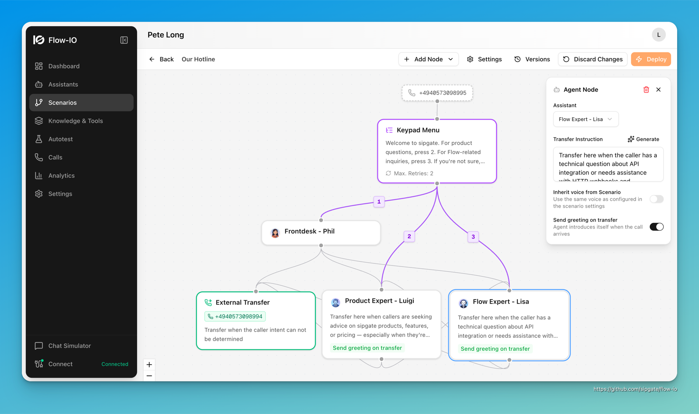

# Flow-IO

**Open-source AI voice assistant platform.** Connect your sipgate phone numbers to AI assistants — built with Next.js, Supabase, and the sipgate AI Flow SDK.



**App only (requires external Supabase):**

[](https://railway.com/new/template?template=https://github.com/sipgate/flow-io)

---

## Features

✅ **sipgate OAuth login** — sign in with your sipgate account; phone numbers are imported automatically  
✅ **AI Voice Assistants** — custom personalities, system prompts, LLM provider choice (OpenAI, Gemini, Mistral)  
✅ **Visual Call Flows** — drag-and-drop routing logic with multiple agents and scenarios  
✅ **Knowledge Base** — RAG-powered context injection via pgvector  
✅ **Real-time Call Monitoring** — live transcripts and dashboards via WebSocket + Supabase Realtime  
✅ **Post-call Evaluation** — CSAT scoring and configurable success criteria per assistant  
✅ **Multi-tenancy** — organizations with role-based access control and Row Level Security  
✅ **Webhooks & MCP** — post-call actions, tool integrations, MCP server support  
✅ **Automated Testing** — call simulation and regression testing framework  
✅ **i18n** — English and German UI  

🔜 **LLM Cascading** — automatic fallback chain across providers on failure  
🔜 **A/B Testing** — split traffic across prompt variants and compare performance  
🔜 **Human Takeover** — escalate live calls to a human agent from the dashboard

---

## Quick Start — Self-Hosting (Docker)

The fastest way to run everything locally or on a server:

```bash
# 1. Clone
git clone https://github.com/BlackMac/flow-io.git
cd flow-io

# 2. Configure
cp .env.docker.example .env.docker
# Edit .env.docker — fill in your API keys (see Prerequisites below)

# 3. Start
docker compose --env-file .env.docker up -d
```

| Service | URL |
|---------|-----|
| Flow-IO app | http://localhost:3000 |
| Supabase Studio | http://localhost:8000 (login: DASHBOARD_USERNAME/PASSWORD) |
| Email test inbox | http://localhost:54324 |

Everything runs in one command: Postgres, Auth, Storage, Realtime, the app, and automatic database migrations.

---

## Prerequisites

You need accounts / API keys for:

| Service | Purpose | Link |
|---------|---------|------|
| **sipgate** | Login + phone numbers | [Register](https://www.sipgate.de) · [Create OAuth app](https://console.sipgate.com/third-party-clients) |
| **OpenAI** | LLM + embeddings | [platform.openai.com](https://platform.openai.com) |
| **ElevenLabs** | Text-to-speech | [elevenlabs.io](https://elevenlabs.io) |

**sipgate OAuth app setup:**
1. Go to [console.sipgate.com/third-party-clients](https://console.sipgate.com/third-party-clients)
2. Create a new app, set redirect URI to `https://your-domain.com/api/auth/sipgate/callback`
3. Copy Client ID and Client Secret into `.env.docker` (or `.env.local` for dev)

Supabase and Google Gemini / Mistral are optional (Supabase Cloud or self-hosted via Docker).

---

## Deployment

Flow-IO needs a **Next.js host** and a **Supabase instance** (Postgres + Auth + Storage + Realtime). The Docker setup bundles everything. For PaaS platforms, you use [Supabase Cloud](https://supabase.com) (free tier available) for the backend.

| Platform | Supabase needed? | Notes |
|----------|-----------------|-------|
| **Docker** (self-hosted) | ❌ bundled | Full control, runs anywhere |
| **Coolify** | ❌ bundled | Git-connected, deploys full `docker-compose.yml` |
| **Railway** (UI import) | ❌ bundled | Drag `docker-compose.yml` onto Railway canvas |
| **Railway** (button) | ✅ Supabase Cloud | App only, add env vars |
| **Render** | ✅ Supabase Cloud | Deploy as Docker container |
| **Fly.io / any Docker host** | ✅ Supabase Cloud | `docker run` the app image |

### Docker (self-hosted, everything included)

Follow the [Quick Start](#quick-start--self-hosting-docker) above. Supabase runs alongside the app — no external accounts needed.

### Coolify (full-stack, Supabase bundled)

[Coolify](https://coolify.io) is an open-source self-hosted PaaS that deploys directly from your Git repo using `docker-compose.yml`.

1. In Coolify, create a new **Resource → Docker Compose**
2. Connect your GitHub repo (or paste the repo URL)
3. Set the Docker Compose file to `docker-compose.yml`
4. Add all environment variables from `.env.docker.example` in the Coolify UI
5. Deploy — Coolify starts all services and handles restarts automatically

Coolify also provides automatic HTTPS, a web UI for logs, and one-click redeploys on git push.

### Railway UI import (full-stack, Supabase bundled)

Railway supports importing a `docker-compose.yml` via drag & drop onto the project canvas:

1. Create a new Railway project at [railway.app](https://railway.app)
2. Drag your local `docker-compose.yml` onto the project canvas — Railway creates each service automatically
3. Add all environment variables from `.env.docker.example` in the Railway dashboard
4. Deploy

Note: Railway's docker-compose import is still evolving and not all compose features are supported yet.

### PaaS (Railway button, Render, …) + Supabase Cloud

These options only host the app — use [Supabase Cloud](https://supabase.com) (free tier works) for the backend:

1. **Create a Supabase project** at [supabase.com](https://supabase.com)
2. **Run migrations:**
   ```bash
   npx supabase link --project-ref your-project-ref
   npx supabase db push
   ```
3. **Deploy the app** — click one of the buttons at the top, or deploy manually to any platform that can run a Docker container or Node.js
4. Set all environment variables from `.env.example`

### Required Environment Variables

| Variable | Description |
|----------|-------------|
| `NEXT_PUBLIC_SUPABASE_URL` | Supabase project URL |
| `NEXT_PUBLIC_SUPABASE_ANON_KEY` | Supabase anon key |
| `SUPABASE_SERVICE_ROLE_KEY` | Supabase service role key |
| `SIPGATE_OAUTH_CLIENT_ID` | sipgate OAuth client ID |
| `SIPGATE_OAUTH_CLIENT_SECRET` | sipgate OAuth client secret |
| `SIPGATE_WEBHOOK_SECRET` | Shared secret for webhook HMAC-SHA256 signature verification |
| `SIPGATE_WEBHOOK_TOKEN` | Token for WebSocket authentication (`x-api-token` header) |
| `NEXT_PUBLIC_APP_URL` | Canonical app URL for OAuth redirects and email links (required in production) |
| `OPENAI_API_KEY` | OpenAI API key |
| `ELEVENLABS_API_KEY` | ElevenLabs API key |

See [`.env.example`](.env.example) for the full list including optional variables.

---

## Local Development

```bash
# Install dependencies
npm install

# Copy and fill in environment variables
cp .env.example .env.local

# Start Supabase locally
npx supabase start

# Apply migrations
npx supabase db push

# Start dev server
npm run dev
```

Open [http://localhost:3000](http://localhost:3000).

---

## Architecture

```
┌──────────────────────────────────────────┐
│              Next.js App                 │
│  (Frontend + API routes + Server Actions)│
└───────────┬──────────────┬───────────────┘
            │              │
    ┌───────▼──────┐  ┌────▼────────────┐
    │   Supabase   │  │    sipgate      │
    │              │  │                 │
    │ - Auth       │  │ - OAuth login   │
    │ - PostgreSQL │  │ - AI Flow SDK   │
    │ - pgvector   │  │ - Webhooks      │
    │ - Storage    │  │ - Phone numbers │
    │ - Realtime   │  └─────────────────┘
    └───────┬──────┘
            │
    ┌───────▼──────────────┐
    │   LLM Providers      │
    │  OpenAI · Gemini     │
    │  Mistral · ElevenLabs│
    └──────────────────────┘
```

**Auth flow:**
1. User clicks "Mit sipgate anmelden"
2. sipgate OAuth2 (scopes: `openid profile email account:read numbers:read all`)
3. Phone numbers are synced from the sipgate account automatically
4. Organization is created, user lands on the dashboard

Users can also sign up with email/password and connect their sipgate account later in Settings → Telefonie.

---

## Tech Stack

| Layer | Technology |
|-------|-----------|
| Framework | [Next.js 16](https://nextjs.org/) (App Router, standalone output) |
| Language | TypeScript (strict) |
| Styling | [Tailwind CSS v4](https://tailwindcss.com/) + [shadcn/ui](https://ui.shadcn.com/) |
| Database | [Supabase](https://supabase.com/) PostgreSQL + pgvector |
| Auth | Supabase Auth + sipgate OAuth2 |
| Telephony | [sipgate AI Flow SDK](https://sipgate.github.io/sipgate-ai-flow-api/) |
| LLM | OpenAI GPT-5.4 · Google Gemini · Mistral |
| TTS | [ElevenLabs](https://elevenlabs.io/) |
| Testing | [Vitest](https://vitest.dev/) |

---

## Database Schema

Key tables (all with Row Level Security):

| Table | Purpose |
|-------|---------|
| `organizations` | Workspaces / tenants |
| `organization_members` | User↔org relationships with roles |
| `assistants` | AI assistant configurations |
| `call_scenarios` | Visual routing scenario definitions |
| `call_sessions` | Call records |
| `call_transcripts` | Conversation transcripts |
| `knowledge_bases` | Document collections |
| `kb_chunks` | Document chunks with vector embeddings |
| `phone_numbers` | Phone numbers synced from sipgate |
| `telephony_accounts` | Connected telephony provider accounts (per org) |
| `webhooks` | Post-call webhook configurations |

---

## Project Structure

```
flow-io/
├── app/
│   ├── (auth)/              # Login, signup, forgot-password
│   ├── [orgSlug]/           # Org-scoped pages (dashboard, assistants, …)
│   └── api/
│       ├── auth/sipgate/    # sipgate OAuth callback + complete
│       └── sipgate/webhook  # sipgate AI Flow webhook handler
├── components/
│   ├── ui/                  # shadcn/ui base components
│   ├── auth/                # Login buttons
│   ├── assistants/          # Assistant management UI
│   ├── settings/            # Org settings (incl. telephony section)
│   └── …
├── lib/
│   ├── supabase/            # Supabase client (browser + server)
│   ├── telephony/           # Modular telephony provider layer
│   │   └── providers/
│   │       └── sipgate/     # sipgate OAuth, REST client, phone sync
│   ├── llm/                 # LLM provider abstraction
│   ├── embeddings/          # pgvector operations
│   └── flow-engine/         # Call flow execution
├── supabase/
│   ├── migrations/          # SQL migrations (applied automatically in Docker)
│   └── config.toml
├── docker-compose.yml       # Full self-hosted stack
├── .env.example             # Environment variable reference
└── .env.docker.example      # Docker-specific env reference
```

---

## Contributing

1. Fork the repo and create a branch
2. Follow the code style (TypeScript strict, no `any`)
3. Write tests for new features (`npm test` must pass)
4. Run `npm run type-check` and `npm run build` before opening a PR
5. Use [conventional commit messages](https://www.conventionalcommits.org/)

---

## License

MIT — see [LICENSE](./LICENSE) for details.

---

## Links

- [sipgate AI Flow API docs](https://sipgate.github.io/sipgate-ai-flow-api/)
- [Supabase docs](https://supabase.com/docs)
- [Issues](https://github.com/BlackMac/flow-io/issues)
