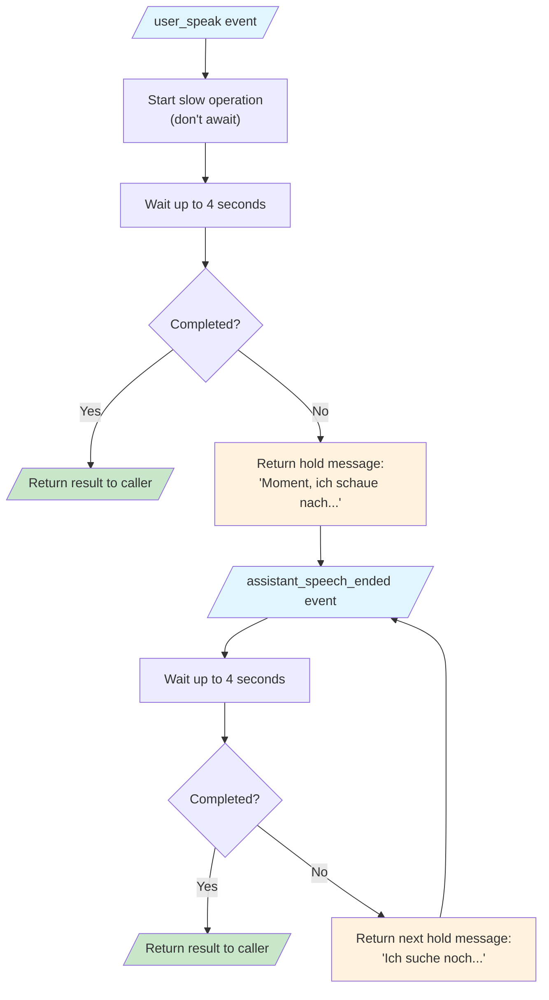

# Handling Long-Running Requests in Voice AI: The Async Hold Pattern

When building voice AI assistants that integrate with external tools (like MCP servers, RAG systems, or slow APIs), you'll inevitably face a challenge: **sipgate AI Flow has webhook timeout limits**, but your backend operations might take much longer.

This guide explains how to implement an elegant solution we call the "Async Hold Pattern" - keeping callers engaged while your system processes their request in the background.

## The Problem

sipgate AI Flow enforces webhook timeout limits of approximately **5 seconds**. If your server doesn't respond in time, the platform may drop the connection or return an error to the caller.

But what if your assistant needs to:
- Query a slow external API (20+ seconds)
- Search through a large knowledge base
- Call an MCP (Model Context Protocol) server
- Perform complex RAG operations
- Fetch real-time data from third-party services

You can't make the caller wait in silence, and you can't speed up the external service. So what do you do?

## The Solution: Async Hold Pattern

Instead of blocking on the slow operation, we:

1. **Start the operation in the background** (don't await it)
2. **Wait briefly** for a quick response (e.g., 4 seconds)
3. **If completed quickly** → return the result directly
4. **If still pending** → tell the caller to wait, then check again when they're done listening

This leverages a key insight: **sipgate AI Flow sends an `assistant_speech_ended` event when the assistant finishes speaking**. We can use this to create a polling loop that keeps the caller informed.



## Implementation

### Step 1: Create a Pending State Manager

First, we need a way to store the background promise and track state across webhook calls. Since each webhook call is a separate HTTP request, we need shared state:

```typescript
// pending-state.ts

interface PendingState {
  promise: Promise<{ response: string; error?: string }>
  startedAt: number
  holdMessageCount: number
  userMessage: string
}

// In-memory store (use Redis for multi-instance deployments)
const pendingStates = new Map<string, PendingState>()

// Hold messages - rotate through these while waiting
const HOLD_MESSAGES_DE = [
  'Moment, ich schaue nach...',
  'Ich suche noch...',
  'Einen kleinen Moment noch...',
  'Fast fertig...',
]

const HOLD_MESSAGES_EN = [
  'One moment, let me check...',
  'Still searching...',
  'Just a moment longer...',
  'Almost there...',
]

// How long to wait before responding (stay under sipgate's timeout!)
const WAIT_BEFORE_RESPONSE_MS = 4000

export function startPending(
  sessionId: string,
  promise: Promise<{ response: string; error?: string }>,
  userMessage: string
): void {
  pendingStates.set(sessionId, {
    promise,
    startedAt: Date.now(),
    holdMessageCount: 0,
    userMessage,
  })
}

export function hasPending(sessionId: string): boolean {
  return pendingStates.has(sessionId)
}

export function cancelPending(sessionId: string): void {
  pendingStates.delete(sessionId)
}

export function getNextHoldMessage(sessionId: string, language: 'de' | 'en' = 'de'): string {
  const state = pendingStates.get(sessionId)
  const messages = language === 'de' ? HOLD_MESSAGES_DE : HOLD_MESSAGES_EN

  if (!state) return messages[0]

  const index = Math.min(state.holdMessageCount, messages.length - 1)
  state.holdMessageCount++
  return messages[index]
}

export async function waitForCompletion(
  sessionId: string
): Promise<{ response: string; error?: string } | null> {
  const state = pendingStates.get(sessionId)
  if (!state) return null

  // Race between the promise and a timeout
  const timeoutPromise = new Promise<null>((resolve) => {
    setTimeout(() => resolve(null), WAIT_BEFORE_RESPONSE_MS)
  })

  const result = await Promise.race([state.promise, timeoutPromise])

  if (result !== null) {
    // Completed! Clean up and return
    pendingStates.delete(sessionId)
    return result
  }

  return null // Still pending
}
```

### Step 2: Handle the Initial `user_speak` Event

When a user speaks, start the background operation and wait briefly:

```typescript
// webhook-handler.ts

async function handleUserSpeak(event: {
  type: 'user_speak'
  session: { id: string }
  text: string
}) {
  const sessionId = event.session.id

  // Cancel any existing pending operation (user asked a new question)
  cancelPending(sessionId)

  // Start the slow operation in background (DON'T await the full operation!)
  const operationPromise = performSlowOperation(event.text)
    .then(result => ({ response: result }))
    .catch(error => ({ response: '', error: String(error) }))

  // Wait up to 4 seconds for completion
  const INITIAL_WAIT_MS = 4000
  const timeoutPromise = new Promise<null>((resolve) => {
    setTimeout(() => resolve(null), INITIAL_WAIT_MS)
  })

  const quickResult = await Promise.race([operationPromise, timeoutPromise])

  if (quickResult !== null) {
    // Completed quickly! Return result directly - no hold message needed
    console.log('Operation completed within 4s - returning direct response')

    if (quickResult.error) {
      return createSpeakResponse(sessionId, 'Es tut mir leid, es gab einen Fehler.')
    }

    return createSpeakResponse(sessionId, quickResult.response)
  }

  // Taking too long - switch to hold pattern
  console.log('Operation taking >4s - using hold pattern')

  // Store the promise for the assistant_speech_ended handler
  startPending(sessionId, operationPromise, event.text)

  // Return hold message
  return createSpeakResponse(sessionId, getNextHoldMessage(sessionId, 'de'))
}

function createSpeakResponse(sessionId: string, text: string) {
  return {
    type: 'speak',
    session_id: sessionId,
    text: text,
    tts: {
      provider: 'azure',
      language: 'de-DE',
      voice: 'de-DE-KatjaNeural',
    },
  }
}
```

### Step 3: Handle the `assistant_speech_ended` Event

This is the key insight: sipgate AI Flow sends an `assistant_speech_ended` event when the assistant finishes speaking. **You can return a new action from this event!**

```typescript
async function handleAssistantSpeechEnded(event: {
  type: 'assistant_speech_ended'
  session: { id: string }
}) {
  const sessionId = event.session.id

  // No pending operation? Nothing to do - return 204 No Content
  if (!hasPending(sessionId)) {
    return new Response(null, { status: 204 })
  }

  // Wait for completion (up to 4 seconds to maximize processing time)
  const result = await waitForCompletion(sessionId)

  if (result !== null) {
    // Done! Return the actual response
    console.log('Operation completed - returning result')

    if (result.error) {
      return createSpeakResponse(
        sessionId,
        'Es tut mir leid, ich konnte die Information nicht finden.'
      )
    }

    return createSpeakResponse(sessionId, result.response)
  }

  // Still pending - say another hold message and wait for next speech_ended
  console.log('Still waiting - returning another hold message')
  return createSpeakResponse(sessionId, getNextHoldMessage(sessionId, 'de'))
}
```

### Step 4: Wire Up the Webhook Router

```typescript
export async function POST(request: Request) {
  const event = await request.json()

  switch (event.type) {
    case 'session_start':
      return handleSessionStart(event)

    case 'user_speak':
      return handleUserSpeak(event)

    case 'assistant_speech_ended':
      return handleAssistantSpeechEnded(event)

    case 'session_end':
      // Clean up any pending state
      cancelPending(event.session.id)
      return handleSessionEnd(event)

    default:
      // Return 204 for events we don't handle
      return new Response(null, { status: 204 })
  }
}
```

## Key Insights

### Why 4 Seconds?

sipgate AI Flow has approximately a 5 second timeout. We use 4 seconds to:
- Leave buffer for network latency
- Allow time for the response to be transmitted
- Stay safely under the limit

You can adjust this value, but always leave at least 500ms-1s of buffer.

### The `assistant_speech_ended` Event is Powerful

Many developers overlook this event, but it's the key to the async pattern. When the assistant finishes speaking, sipgate sends this event and **waits for your response**. You can:
- Return a new `speak` action to continue talking
- Return `204 No Content` to stay silent and wait for user input
- Check if your background operation completed

This creates a natural polling mechanism without awkward silences.

### Memory vs. Redis

The example uses an in-memory `Map` for simplicity. This works for single-instance deployments, but for production with multiple server instances behind a load balancer, use Redis:

```typescript
import Redis from 'ioredis'

const redis = new Redis(process.env.REDIS_URL)

// Store metadata in Redis (promises can't be serialized)
export async function startPending(sessionId: string, ...) {
  await redis.setex(
    `pending:${sessionId}`,
    120, // 2 minute TTL
    JSON.stringify({
      startedAt: Date.now(),
      holdMessageCount: 0,
      userMessage
    })
  )

  // Keep promise reference in memory (same instance will handle it)
  pendingPromises.set(sessionId, promise)
}
```

### Always Cancel Previous Operations

When a user asks a new question while you're still processing the old one, cancel the old operation:

```typescript
// In user_speak handler - always cancel previous pending operation
cancelPending(event.session.id)
```

This prevents confusion and wasted resources. The user doesn't care about the old answer anymore.

### Clean Up on Session End

Always clean up when the call ends:

```typescript
case 'session_end':
  cancelPending(event.session.id)
  return handleSessionEnd(event)
```

## Advanced: Caching Slow Initializations

If your slow operation has a one-time initialization step (like discovering available tools from an MCP server), cache it separately:

```typescript
// BAD: Fetching tool definitions on every request
async function handleUserSpeak(event) {
  const tools = await mcpServer.listTools() // SLOW - 5+ seconds!
  const response = await llm.generate({ tools, message: event.text })
  return createSpeakResponse(sessionId, response)
}

// GOOD: Cache tool definitions, only fetch once
async function handleUserSpeak(event) {
  // Tools were cached when server was configured
  const tools = await database.get('mcp_server_tools', serverId) // FAST - <100ms
  const response = await llm.generate({ tools, message: event.text })
  return createSpeakResponse(sessionId, response)
}

// Cache tools when MCP server is configured (admin action)
async function configureMcpServer(serverUrl: string) {
  const tools = await mcpServer.listTools() // Slow, but only happens once
  await database.set('mcp_server_tools', serverId, tools)
}
```

This separates "one-time setup" (caching tool definitions) from "per-request work" (calling tools), dramatically improving response times.

## Complete Minimal Example

Here's a self-contained example you can adapt:

```typescript
// ============================================
// pending-state.ts
// ============================================

const pendingStates = new Map<string, {
  promise: Promise<{ response: string; error?: string }>
  holdCount: number
}>()

const HOLD_MESSAGES = [
  'Einen Moment bitte...',
  'Ich suche noch...',
  'Gleich habe ich es...',
]
const WAIT_MS = 4000

export const pending = {
  start(id: string, promise: Promise<{ response: string; error?: string }>) {
    pendingStates.set(id, { promise, holdCount: 0 })
  },

  has(id: string): boolean {
    return pendingStates.has(id)
  },

  cancel(id: string): void {
    pendingStates.delete(id)
  },

  getHoldMessage(id: string): string {
    const state = pendingStates.get(id)
    if (!state) return HOLD_MESSAGES[0]
    return HOLD_MESSAGES[Math.min(state.holdCount++, HOLD_MESSAGES.length - 1)]
  },

  async wait(id: string): Promise<{ response: string; error?: string } | null> {
    const state = pendingStates.get(id)
    if (!state) return null

    const timeout = new Promise<null>(r => setTimeout(() => r(null), WAIT_MS))
    const result = await Promise.race([state.promise, timeout])

    if (result !== null) {
      pendingStates.delete(id)
    }
    return result
  },
}

// ============================================
// webhook.ts
// ============================================

import { pending } from './pending-state'

export async function POST(req: Request): Promise<Response> {
  const event = await req.json()
  const sessionId = event.session.id

  // Handle user_speak - start background operation
  if (event.type === 'user_speak') {
    pending.cancel(sessionId) // Cancel any previous operation

    // Start slow operation (don't await fully!)
    const promise = slowExternalApiCall(event.text)
      .then(result => ({ response: result }))
      .catch(err => ({ response: '', error: String(err) }))

    // Wait up to 4 seconds
    const timeout = new Promise<null>(r => setTimeout(() => r(null), 4000))
    const quick = await Promise.race([promise, timeout])

    // If completed quickly, return result directly
    if (quick !== null) {
      if (quick.error) {
        return speak(sessionId, 'Es gab leider einen Fehler.')
      }
      return speak(sessionId, quick.response)
    }

    // Taking too long - use hold pattern
    pending.start(sessionId, promise)
    return speak(sessionId, pending.getHoldMessage(sessionId))
  }

  // Handle assistant_speech_ended - check if operation completed
  if (event.type === 'assistant_speech_ended') {
    if (!pending.has(sessionId)) {
      return new Response(null, { status: 204 })
    }

    const result = await pending.wait(sessionId)

    if (result !== null) {
      if (result.error) {
        return speak(sessionId, 'Die Anfrage konnte nicht bearbeitet werden.')
      }
      return speak(sessionId, result.response)
    }

    // Still waiting - another hold message
    return speak(sessionId, pending.getHoldMessage(sessionId))
  }

  // Handle session_end - clean up
  if (event.type === 'session_end') {
    pending.cancel(sessionId)
  }

  return new Response(null, { status: 204 })
}

function speak(sessionId: string, text: string): Response {
  return Response.json({
    type: 'speak',
    session_id: sessionId,
    text,
    tts: {
      provider: 'azure',
      language: 'de-DE',
      voice: 'de-DE-ConradNeural',
    },
  })
}

// Your slow operation (replace with actual implementation)
async function slowExternalApiCall(query: string): Promise<string> {
  // Simulating a slow API call
  await new Promise(r => setTimeout(r, 15000))
  return `Here's what I found about "${query}"...`
}
```

## Conclusion

The Async Hold Pattern transforms a technical limitation into a natural conversation flow. Instead of timing out or making users wait in awkward silence, your assistant says "Einen Moment bitte..." - just like a human would.

**Key takeaways:**

1. **Start slow operations without awaiting** - let them run in the background
2. **Wait briefly (4 seconds)** before deciding to use hold messages
3. **Use the `assistant_speech_ended` event** to poll for completion
4. **Keep messages varied** - rotate through different hold phrases
5. **Always clean up** - cancel pending operations when no longer needed
6. **Cache when possible** - separate one-time setup from per-request work

This pattern works with any slow backend operation: MCP servers, RAG pipelines, external APIs, database queries, or anything else that might exceed the webhook timeout.

---

*For more information about sipgate AI Flow events and actions, see the [sipgate AI Flow API documentation](https://sipgate.github.io/sipgate-ai-flow-api/).*
